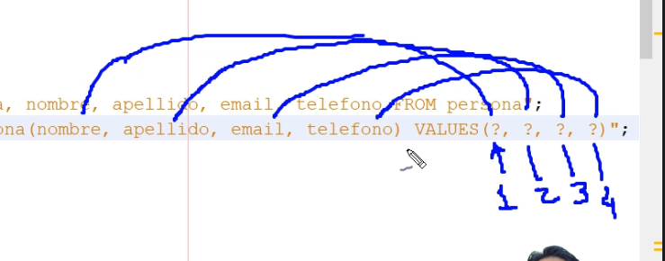

# Segregacion JDBC

## Metodo `seleccionar()`

Utilizaremos la clase `Persona` para agregar, modificar eleminar registros. 
A esta clase que puede hacer este tipo de operaciones sobre la bd, se le llama 
**clase entidad** y utiliza el patron de diseño Data Access Object (DAO). 

* Se asocia por cada clase entidad una clase DAO asociada a dicha clase `PersonaDAO`

-----

`PrepareStatement` > `Statement` - mayor eficiencia con QUERY pero hacen lo mismo


----
Ahora no siemplemente imprimimos los registros, sino que los creamos un objeto en java
por cada registro:
```java
while(rs.next()){
    int idPersona = rs.getInt("id_persona");
    String nombre = rs.getString("nombre");
    String apellido = rs.getString("apellido");
    String email = rs.getString("email");
    String telefono = rs.getString("telefono");
    persona = new Persona(idPersona, nombre, apellido, email, telefono); // linea importante
    personas.add(persona);
}
```

----
Comparamos los 2 test y nos damos cuenta que en el de ManejoPersonas esta el codigo 
mucho mas segregado, a esto se le conoce como **bajo acoplamiento** debido a que cada
clase tiene las relaciones minimas con cada una de las otras clases y tambien se 
conoce como **alta cuestion** ya que cada clase realiza unicamente su tarea x ejem:
* realizar conexion a bd
* definir secuencia sql
* ejecutar sentencia
* iterar resultados
* cerrar conexion

Al tener mejor distribucion = estamos creando **capa de datos** y el patrón de diseño
**DAO**

----------

## Metodo `insertar()`
```java
private static final String SLQ_INSERT = 
    "INSERT INTO test.persona(nombre, apellido, email, telefono) VALUES(?, ?, ?, ?)";
```
? son los respectivos campos. Igual que cuando en un metodo precisa un parametro que luego
va a modificar la variable de la clase:

```java
metodo(String nombre){
nombre = this.nombre
}
```

VALUES(?, ?, ?, ?) = VALUES(nombre, apellido, email, telefono)

Lo ponemos así para luego poner en el metodo `insertar()` aquellos parametros que quiero insertar en 
el registro:




